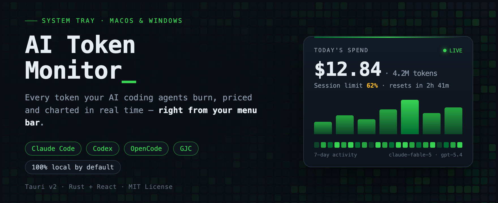
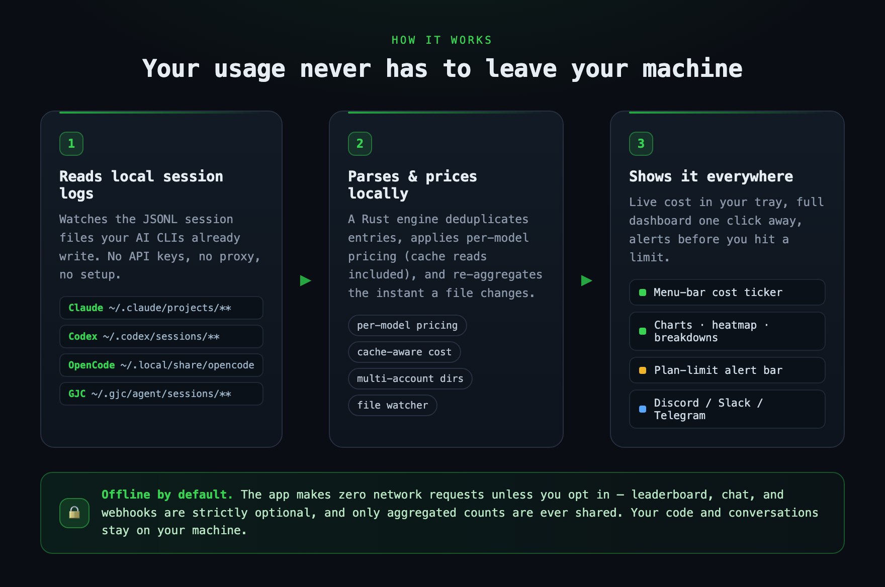
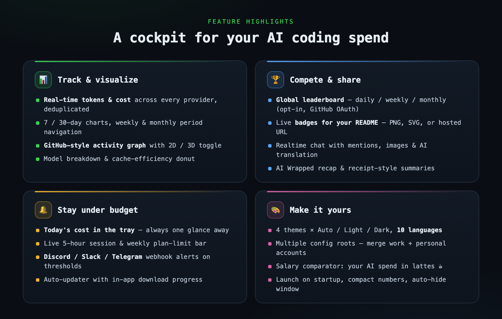

# AI Token Monitor

[](https://github.com/soulduse/ai-token-monitor/releases/latest)
[](../LICENSE)

> **[English](../README.md) | [한국어](README.ko.md) | [日本語](README.ja.md) | [繁體中文](README.zh-TW.md) | [Türkçe](README.tr.md) | [Italiano](README.it.md)**



**AI Token Monitor** 是一款轻量的 macOS / Windows 系统托盘应用,全天候回答一个问题:*我的 AI 编程工具到底花了多少钱?* 它读取 **Claude Code**、**Codex**、**OpenCode**、**GJC** 和 **Grok** 本来就在写入的本地会话日志,按各模型单价(含缓存读取)为每个令牌计费,并把今日支出直接显示在时钟旁边——图表、套餐限额提醒、可选的排行榜、聊天和 Webhook 通知都只需一次点击。

- **零配置** — 无需 API 密钥、无需代理。只要运行过一次 Claude Code 或 Codex,即刻可用。
- **支出一目了然** — 菜单栏 / 系统托盘实时显示费用,点击即可打开完整仪表盘。
- **抢先于限额** — 实时显示 5 小时会话与每周套餐限额进度条,并在触顶前通过 Discord / Slack / Telegram 提醒。
- **隐私优先** — 默认 100% 离线;排行榜、聊天和 Webhook 均为严格可选。

| 概览 | 分析 | 排行榜 |
|:---:|:---:|:---:|
|  |  |  |
| 今日使用量、7 天图表、周/月汇总 | 活动图、30 天趋势、模型分析 | 与其他开发者比较使用量 |

## 下载

**[下载最新版本](https://github.com/soulduse/ai-token-monitor/releases/latest)**

| 平台 | 文件 | 备注 |
|------|------|------|
| **macOS** (Apple Silicon) | `.dmg` | Intel Mac 即将支持 |
| **Windows** | `.exe` 安装程序 | Windows 10+(需要 WebView2,自动安装) |

## 工作原理



1. **读取本地会话日志** — 监视 AI CLI 本来就在写入的 JSONL 文件(具体路径见[数据源](#数据源))
2. **本地解析与计费** — Rust 引擎对条目去重,应用各模型单价(含缓存读取),文件一变化立即重新汇总
3. **随处可见** — 托盘费用显示、仪表盘图表、套餐限额提醒条,以及可选的 Webhook 通知

以上全部在你的电脑上完成。除非你主动开启排行榜、聊天或 Webhook,应用**不会发出任何网络请求**——即使开启,也只会共享汇总数据,绝不会共享代码或对话内容。

## 主要功能



### 追踪与可视化
- **实时令牌追踪** — 直接解析 Claude Code / Codex / OpenCode 的会话 JSONL 文件,准确统计使用量
- **多提供商支持** — 在 Claude / Codex / OpenCode 之间切换,每个提供商使用独立的价格模型
- **多配置目录** — 可同时添加多个 Claude/Codex 根目录,聚合工作与个人帐号的使用量
- **日图表** — 7/30 天令牌或费用柱状图(含 Y 轴标签)
- **活动图** — GitHub 风格贡献热力图(支持 2D/3D 切换与按年浏览)
- **周期导航** — 使用 `< >` 箭头浏览过去的周/月汇总
- **模型分析** — Input/Output/Cache 比例可视化
- **缓存效率** — 缓存命中率环形图
- **用量提醒栏** — 实时显示 Claude Code 5 小时会话和每周用量上限(可选 Claude OAuth 登录)

### 社交与分享
- **排行榜** — 与其他开发者比较日/周/月使用量(GitHub OAuth,需主动开启)
- **7 天 TOP 10 网格** — 直观展示排名历史
- **迷你个人资料** — 活动热力图、连续使用天数、外部资料链接
- **徽章** — Card / Compact / Flat Square 样式,可导出为 PNG / SVG / Markdown 或动态 URL,嵌入到 GitHub README 中
- **聊天** — 面向排行榜成员的应用内聊天,支持提及、回复、图片附件、未读徽章、正在输入提示以及 AI 翻译
- **AI 报告 (Wrapped)** — 月度/年度回顾卡片(最常用模型、最忙碌的一天、连续记录)
- **收据视图** — 今日 / 本周 / 本月 / 全部 的收据式使用摘要
- **薪资对比** — 将 AI 支出换算为月薪占比(拿铁 / Netflix / 炸鸡)
- **分享与导出** — 通过顶栏菜单复制 Markdown 摘要、截图或应用分享消息

### 提醒
- **托盘费用** — 在托盘图标旁显示今日费用(macOS 菜单栏标题,Windows 工具提示)
- **Webhook 通知** — 用量达到阈值或重置时通过 Discord / Slack / Telegram 通知
- **自动更新器** — 应用内更新提示,含下载进度

### 自定义
- **4 种主题** — GitHub(绿色)、Purple、Ocean、Sunset,并支持自动/浅色/深色模式
- **10 种语言** — English, 한국어, 日本語, 简体中文, 繁體中文, Français, Español, Deutsch, Türkçe, Italiano
- **数字格式** — 紧凑(`377.0K`)/ 完整(`377,000`)切换
- **开机自启** — 可选开机自动启动
- **AI 翻译** — 添加 Gemini / OpenAI / Anthropic API 密钥后可翻译聊天消息(密钥在本地加密存储)
- **自动隐藏** — 点击窗口外自动隐藏

## 从源码安装

### 前提条件

- [Node.js](https://nodejs.org/) 18+
- [Rust](https://rustup.rs/) 工具链
- [Tauri CLI v2](https://v2.tauri.app/start/prerequisites/)
- 已安装 [Claude Code](https://claude.ai/claude-code)、[Codex](https://openai.com/index/introducing-codex/) 或 [OpenCode](https://opencode.ai) 中至少一个,并且至少使用过一次

### 构建

```bash
git clone https://github.com/soulduse/ai-token-monitor.git
cd ai-token-monitor
npm install
npm run tauri dev     # 开发模式
npm run tauri build   # 生产构建
```

## 使用方法

### 基本操作

1. 启动应用后,系统托盘(macOS 菜单栏 / Windows 任务栏)中会出现图标
2. 点击图标打开使用量仪表板
3. 在 **概览**、**分析**、**排行榜** 和 **聊天** 标签之间切换

### 标签说明

| 标签 | 内容 |
|------|------|
| **概览** | 今日摘要、7 天图表、周/月汇总、8 周热力图、用量提醒栏 |
| **分析** | 全年活动图(2D/3D)、30 天图表、模型分析、缓存效率 |
| **排行榜** | 使用量排名、7 天 TOP 10 网格、徽章、迷你个人资料 |
| **聊天** | 与排行榜成员实时聊天 — 提及、回复、图片、AI 翻译 |

### 顶栏操作

顶栏包含 **分享按钮**、**⋯ 菜单** 和 **⚙ 设置** 按钮。菜单包含以下项:

- **查看 GitHub 仓库** — 在浏览器中打开仓库
- **我的 AI 报告** — 月度/年度回顾卡片
- **收据** — 收据式使用摘要
- **分享此应用** — 复制推荐消息 + 仓库链接到剪贴板
- **截图到剪贴板** — 将当前视图复制到剪贴板

### 设置

设置分为 4 个标签:

| 标签 | 选项 |
|------|------|
| **常规** | 主题、语言、外观、数字格式、菜单栏费用、开机自启、月薪、用量提醒、Claude/Codex 目录、Claude 用量追踪(OAuth) |
| **账户** | GitHub 登录、排行榜共享、个人资料链接 |
| **AI** | Gemini / OpenAI / Anthropic API 密钥(聊天翻译,本地加密存储) |
| **Webhooks** | Discord / Slack / Telegram Webhook URL、提醒阈值、监控窗口、重置通知 |

### 排行榜与聊天

1. 在 设置 → 账户 中启用 "共享使用数据"
2. 点击 "使用 GitHub 登录"
3. 在排行榜标签查看排名,在聊天标签参与对话

共享的数据:每日令牌总量、费用、消息/会话数。**不共享代码或对话内容。**

## 数据源

| 提供商 | 路径 | 备注 |
|--------|------|------|
| **Claude Code** | `~/.claude/projects/**/*.jsonl` | 从 `~/.claude/stats-cache.json` 补充会话/工具调用数。支持多根目录。 |
| **Codex** | `~/.codex/sessions/**/*.jsonl` | 支持多根目录。 |
| **OpenCode** | `~/.local/share/opencode/**/*.jsonl` | 内置价格注册表按模型计算费用。 |
| **Grok** | `~/.grok/logs/unified.jsonl` | 来自 `shell.turn.inference_done` 的每次请求实测 token；模型与项目从 `~/.grok/sessions` 关联。Grok 会截断该滚动日志的开头，因此按天汇总累积到本地快照。 目前仅支持 macOS — Windows 的日志结构尚未验证。 |

**网络请求**:仅在开启排行榜/聊天时(向 Supabase 发送汇总数据)或 Webhook 触发时才会发起网络请求。不使用这些功能时,应用完全离线运行。配置 AI 翻译密钥后,才会直接向相应提供商发送请求。

## 架构

```
┌────────────────────────────────────┐
│  前端 (React 19 + Vite)            │
│  ├── PopoverShell / Header         │
│  ├── TabBar (4 标签)               │
│  ├── TodaySummary / DailyChart     │
│  ├── ActivityGraph (2D/3D) / Heatmap│
│  ├── ModelBreakdown / CacheEfficiency│
│  ├── Leaderboard + Grid + Badges   │
│  ├── Chat + MentionAutocomplete    │
│  ├── MiniProfile / Wrapped / Receipt│
│  ├── SalaryComparator / UsageAlertBar│
│  └── SettingsOverlay (4 标签)      │
├────────────────────────────────────┤
│  后端 (Tauri v2 / Rust)            │
│  ├── JSONL 会话解析器 (Claude/Codex/OpenCode)│
│  ├── 文件监视 (notify)             │
│  ├── 托盘图标 + 费用显示           │
│  ├── 自动更新器                    │
│  ├── Webhook 分发器                │
│  └── 偏好设置 + 加密密钥           │
├────────────────────────────────────┤
│  外部服务 (可选)                   │
│  ├── Supabase (排行榜 + 聊天)      │
│  ├── Discord / Slack / Telegram    │
│  └── Gemini / OpenAI / Anthropic   │
└────────────────────────────────────┘
```

## 平台支持

| 平台 | 状态 | 备注 |
|------|------|------|
| **macOS** | 支持 | 菜单栏集成、隐藏 Dock、托盘费用标题 |
| **Windows** | 支持 | 系统托盘集成、NSIS 安装程序、工具提示费用显示 |
| **Linux** | 未测试 | Tauri 支持 Linux,基本功能可能可用 |

## 支持

如果您觉得此项目有用,请考虑 [请我喝杯咖啡](https://ctee.kr/place/programmingzombie)。

## 许可证

MIT
